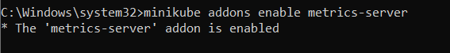

# Horizontal Pod Autoscaler NGINX 📦🌐

### Deployment 
````
apiVersion: apps/v1
kind: Deployment
metadata:
  name: nginx
  labels:
    app: nginx
spec:
  replicas: 2
  strategy:
    type: Recreate
  selector:
    matchLabels:
      app: nginx
  template:
    metadata:
      labels:
        app: nginx
    spec:
      containers:
        - name: nginx
          image: nginx:1.19.4
          resources:
            limits:
              cpu: "500m"
              memory: "128Mi"
            requests:
              memory: "64Mi"
              cpu: "250m"
          ports:
            - containerPort: 80

````

### Service 
````
apiVersion: v1
kind: Service
metadata:
  name: nginx-service
spec:
  type: NodePort
  selector:
    app: nginx
  ports:
    - port: 80
      targetPort: 80

````

### HPA 
````
apiVersion: autoscaling/v2beta2
kind: HorizontalPodAutoscaler
metadata:
  name: nginx-hpa
spec:
  scaleTargetRef:
    apiVersion: apps/v1
    kind: Deployment
    name: nginx
  minReplicas: 1
  maxReplicas: 3
  metrics:
    - type: Resource
      resource:
        name: cpu
        target:
          type: Utilization
          averageUtilization: 50

````

### Horizontal Pod Autoscaler

* Instalamos el Addon metrics-server para que HPA pueda observar el uso de la CPU

`` minikube addons enable metrics-server``

  

### Lanzamos nuestros objetos:


```kubectl apply -f Deployment.yml```

```kubectl apply -f Service.yml```

``` kubectl apply -f HPA.yml```


### Prueba de estres:

* Realizamos peticiones forma masiva con la siguiente instrucion:

``` kubectl run -i --tty load-generator --rm --image=busybox --restart=Never -- /bin/sh -c "while sleep 0.0000000001; do wget -q -O- http://IPSERVICE; done"```

### Consultar HPA

* Para poder visualizar la carga:

```kubectl get hpa nginx-hpa ```